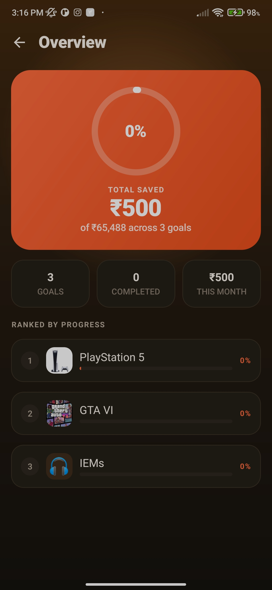
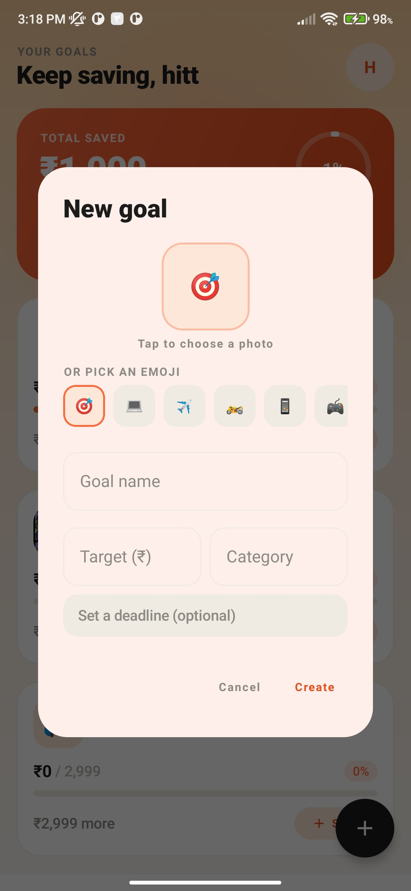
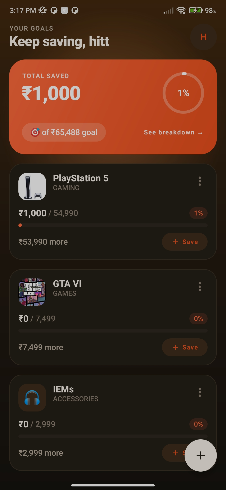
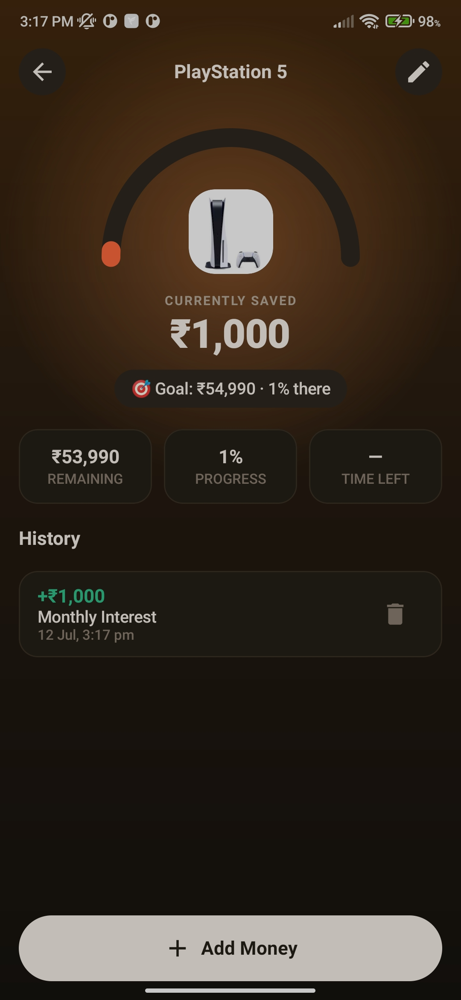

# Savings Goals

Savings Goals is a simple, privacy-focused Android application that helps you track your progress toward personal savings goals.

Whether you're saving for a new phone, laptop, vacation, emergency fund, or any other milestone, the app provides an easy way to record your contributions and monitor your progress without connecting to your bank account or payment services.

---

## Features

- Create and manage multiple savings goals
- Set a target amount for each goal
- Personalize goals with custom emojis
- Record savings contributions manually
- View the complete contribution history for every goal
- Track progress with visual progress bars and percentages
- Delete individual contributions or entire goals

---

## Screenshots

| Overview | Create Goal |
|----------|-------------|
|  |  |

| All Goals | Goal History |
|-----------|--------------|
|  |  |

---

## Privacy

Your financial data belongs to you.

Savings Goals does **not**:

- Require an account
- Collect personal information
- Display advertisements
- Track user activity
- Sync data to the cloud
- Request network permissions

All data is stored locally on your device.

---

## Installation

### Download the latest release

Download the latest APK from the [Releases](../../releases) page and install it on your Android device.

### Build from source

```bash
git clone https://github.com/irohitkun/Savings-Goals.git
cd Savings-Goals
./gradlew assembleDebug
```

You can also open the project directly in Android Studio and run it on an emulator or a physical Android device.

---

## Built With

- Kotlin
- Jetpack Compose
- Material 3
- Room Database
- Android Jetpack Navigation
- Kotlin Symbol Processing (KSP)

---

## Contributing

Contributions are welcome.

If you find a bug, have a feature request, or would like to improve the project, feel free to open an issue or submit a pull request.

---

## License

This project is licensed under the **GNU General Public License v3.0 (GPL-3.0)**.

See the [LICENSE](LICENSE.md) file for details.
